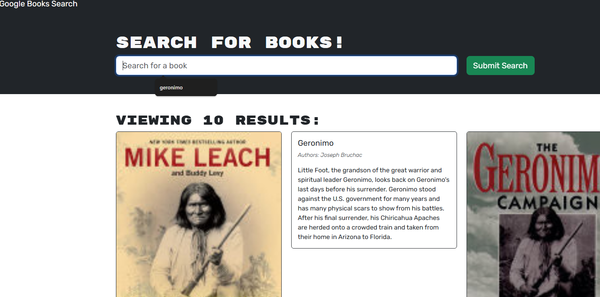

# Book Search Engine

This is a full-stack application that allows users to search for books, save their favorite books, and view their saved books. The back-end is powered by a GraphQL API using Apollo Server, while the front-end is a React application. The project utilizes the MERN stack (MongoDB, Express, React, Node.js) with Apollo Server to handle data fetching and mutations.


## Features

- **Search for Books**: Users can search for books via the Google Books API.
- **Authentication**: Users can sign up, log in, and manage their account.
- **Save Books**: Logged-in users can save books to their account.
- **View Saved Books**: Users can view and remove books from their saved list.

## Tech Stack

- **Front-End**: React, Vite, TypeScript, Apollo Client
- **Back-End**: Node.js, Express, Apollo Server, GraphQL, MongoDB, JWT Authentication
- **Database**: MongoDB (with Mongoose for ODM)
- **Build Tool**: Vite

## Getting Started

### Prerequisites

Before you begin, make sure you have the following installed:

- Node.js (version 14 or higher)
- MongoDB (locally or use MongoDB Atlas)
- npm or yarn (package manager)

### Clone the Repository

```bash
git clone <https://github.com/chicalauren/Social-Network-API.git>
cd book-search-engine
```

### Install Dependencies

For the front-end and back-end:

```bash
npm install
```

This will install all the required dependencies for both the client and the server.

### Set Up Environment Variables

You need to set up your environment variables for MongoDB connection and JWT secret.

1. **Create a `.env` file in the `server/` directory**:
    - Copy the contents of `.env.EXAMPLE` into `.env`.
    - Set the values for `MONGODB_URI` and `JWT_SECRET`:
    
    ```plaintext
    MONGODB_URI=<your-mongodb-uri>
    JWT_SECRET=<your-jwt-secret>
    ```

2. **Configure your front-end**:
    - In the `client/` directory, configure Apollo Client to connect to your GraphQL API server (likely hosted on `http://localhost:4000/graphql` during development).

### Running the Application

To run the back-end and front-end servers, follow these steps:

1. **Start the Back-End (Server)**:
    - In the `server/` directory, run:
    ```bash
    npm run dev
    ```
    - This will start the Express server on `http://localhost:4000`.

2. **Start the Front-End (Client)**:
    - In the `client/` directory, run:
    ```bash
    npm run dev
    ```
    - This will start the Vite development server, and your React app will be accessible at `http://localhost:3000`.

### Test the Application

Once both servers are running:

1. Visit the front-end application at `http://localhost:3000`.
2. You can search for books, sign up or log in, save books to your account, and view your saved books.
3. Try adding and removing books from your saved list to test the full functionality.

## API Endpoints

### **GraphQL API Endpoints** (Back-End)

- **`POST /graphql`**: This is where all GraphQL queries and mutations are sent.
    - **Authentication**: Requires a valid JWT token in the `Authorization` header for certain operations (e.g., saving/removing books).

### Queries & Mutations:

#### Queries:
- **`me`**: Fetches the current authenticated user's data (including saved books).

#### Mutations:
- **`login(email: String!, password: String!)`**: Logs in a user and returns a JWT token and user data.
- **`addUser(username: String!, email: String!, password: String!)`**: Registers a new user and returns a JWT token and user data.
- **`saveBook(bookId: String!, authors: [String]!, description: String, title: String!, image: String, link: String)`**: Saves a book to the authenticated user's account.
- **`removeBook(bookId: String!)`**: Removes a book from the authenticated user's saved books list.

## Deployment

This project is ready to be deployed using a platform like Render, Heroku, or DigitalOcean for the back-end, and Vercel or Netlify for the front-end.

1. **Back-End**:
    - Deploy your server to Render or any cloud platform of your choice.
    - Make sure to add your MongoDB URI and JWT secret as environment variables in the deployment platform.

2. **Front-End**:
    - Build the React app using Vite's build command:
    ```bash
    npm run build
    ```
    - Deploy the `client/dist` folder to platforms like **Vercel** or **Netlify**.

## Contributing

We welcome contributions! If you'd like to improve the project, please fork the repository and submit a pull request.

### Steps for Contributing:
1. Fork the repo.
2. Clone your fork:
    ```bash
    git clone <your-fork-url>
    ```
3. Create a new branch:
    ```bash
    git checkout -b <your-branch-name>
    ```
4. Make your changes.
5. Commit your changes and push to your fork.
6. Create a pull request to merge your changes.

## License

This project is licensed under the MIT License.

## Acknowledgments

- Google Books API for the book search functionality.
- Apollo Server and Express for building the GraphQL API.
- MongoDB and Mongoose for data storage and querying.